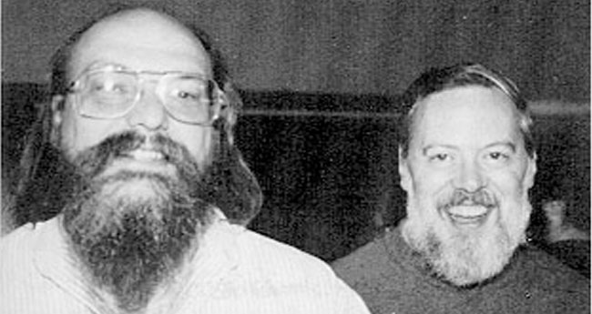
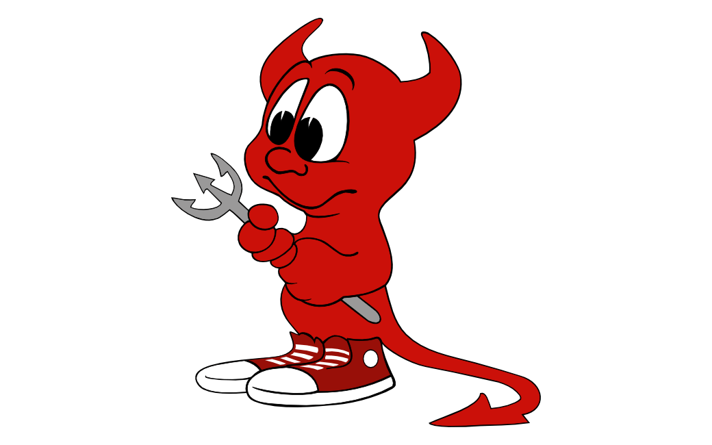
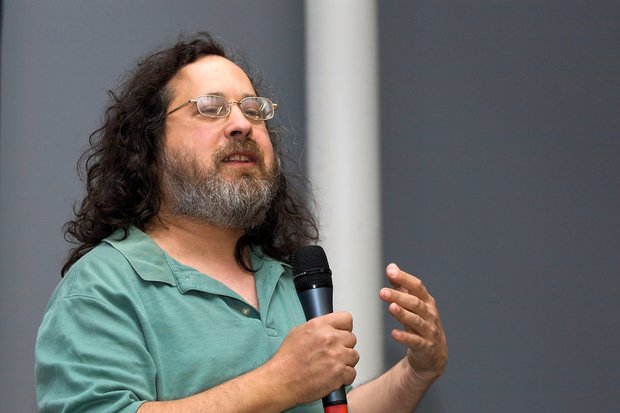

# UNIX

UNIX fue un sistema operativo (ahora es una familia de sistemas
operativos), desarrollado desde principios de los años 70s en los
Laboratorios Bell.

Fue diseñado principalmente por Ken Thompson y escrito por Ken Thompson
y Dennis Ritchie en lenguaje C.

Fue el primer sistema operativo escrito mayormente en un lenguaje de alto
nivel (lenguaje C), por lo que fue el primer sistema operativo portable.

---

# Diseño de UNIX

UNIX fue diseñado de forma modular y pensado como un entorno multitarea
y multiusuario.

El sistema operativo se dividia en:

- Un kernel con un conjunto de llamadas al sistema reducido - Un sistema
de ficheros que provee acceso a archivos y dispositivos - Una shell,
un lenguaje de scripting para interactuar con el sistema

[The UNIX Time-Sharing System](https://people.eecs.berkeley.edu/~brewer/cs262/unix.pdf)

# Filosofía UNIX

Las ideas de modularidad y minimalismo con las que Ken Thompson y Dennis
Ritchie construyeron UNIX sirvieron como normas para el desarrollo de
más software.

Estas ideas suelen agruparse con el nombre de Filosofía UNIX y es uno de
los paradigmas de desarrollo de software más popular entre los sistemas
basados en UNIX.

## Filosofía UNIX

- Escribe programas que hagan una sola cosa y la hagan bien.
- Escribe programas para que trabajen juntos.
- Escribe programas fáciles de ejecutar y probar

[AT&T Archives: The UNIX Operating System](https://www.youtube.com/watch?v=tc4ROCJYbm0)

# BSD

Las primeras versiones de UNIX se distribuían con el código fuente y Bell Labs
permitía su modificación a las universidades estadounidenses. De esta forma
surgió una variante de UNIX en la universidad de Berkeley, llamada Berkeley
Software Distribution.

Cuando AT&T (dueña de Bell Labs) comenzó a comercializar UNIX, el equipo de BSD
comenzó a trabajar en una versión que no incluyera código propiedad de
AT&T y que permitiera su libre distribución.

Sin embargo no lograron escapar a los problemas legales respecto a la propiedad
del código fuente.

---

# El proyecto GNU

El proyecto GNU es un movimiento de software libre que busca crear un
sistema operativo basado en UNIX completamente libre, fue fundado por
Richard Stallman en septiembre de 1983 en el MIT.

La mayoría de las utilidades básicas que se encuentran en una
distribución de Linux son desarrolladas bajo el cobijo del proyecto
GNU y la Free Software Foundation.

---

{width=50%}

---

# MINIX

Andrew Tanenbaum, un profesor de ciencias de la computación en la
Universidad de Amsterdam escribió en 1987 un libro sobre sistemas
operativos y un pequeño microkernel basado en UNIX pero libre de
cualquier codigo propiedad de AT&T con el cual podría dar su clase de
sistemas operativos.

Este sistema operativo ganó popularidad en los foros de internet y muchas
personas comenzaron a escribir programas para MINIX, a extender el sistema
operativo y fue portado a varias plataformas.

Sin embargo, no era en el momento de su publicación software libre o
comercialmente redistribuible.

# LINUX

En 1991 Linus Torvalds, un usuario de MINIX, comenzó a trabajar en su propio
kernel para la arquitectura x86 de Intel.

Linux ganó popularidad en los foros de internet y fue rápidamente emparejado
con el software desarrollado por el proyecto GNU.

El desarrollo de Linux permitió la creación del primer sistema operativo libre
de problemas legales con cualquier compañía que reclamara derechos sobre el
codigo de UNIX.

# Distribuciones

Una distribucion de Linux es una colección de software basada en el kernel de
Linux y un gestor de paquetes de software.

Las distribuciones usualmente proveen un sistema operativo, herramientas de
software y bibliotecas (normalmente de GNU) y un entorno de escritorio. La
mayoría de este software es software libre o de código abierto.

Existen cientos de distribuciones y la mayoría se enfocan en un tipo
de computadora (laptop, escritorio, embebidas, antiguas) o un nicho de
uso en especifico (routers, IoT, Educación, Ciencia, Edición de Audio,
Video, etc).

