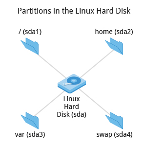
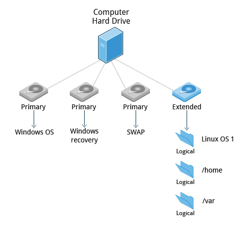

# Planeación de la Instalación

## Elección de una distribución

Retomando la presentación anterior, mencionamos que existen distribuciones que
se enfocan en un nicho especifico.

Por ello antes de instalar una distribución debemos conocer el enfoque y la
filosofía de la misma (si, también la distros traen filosofía incluida).

## Aspectos a tener en cuenta al elegir una distro

- Función del sistema
- Software a ejecutar
- Espacio de almacenamiento disponible
- Estabilidad necesaria en el sistema
- Tiempo de vida del sistema
- Kernel necesario
- Poder de procesamiento
- Hardware
- Requisitos de seguridad

## Algunas distros comunes

::: columns

:::: column

Servidores

- RHEL
- CentOS
- SLES
- Debian

Embebidos

- Yocto
- Open Embedded

::::

:::: column

Escritorio

- Ubuntu
- Fedora
- Arch Linux
- Debian

::::

:::

## Particiones

Una vez elegida la distribución a instalar se debe decidir el número de
particiones que se dedicará a la instalación y el tamaño de las particiones.

{height=50%}

## Redimensionar el disco

Si previamente se esta usando Windows y/o Mac OS X en la computadora
recomiendo usar las herramientas que provee el sistema operativo para
dimensionar el disco, estas suelen ser más rápidas que las que provee
Linux y pueden redimensionar el disco al vuelo.

En el caso de Linux, también es posible redimensionar al vuelo en ciertos
sistemas de ficheros, pero la mayoría de las utilidades advertirán
sobre hacerlo o ni siquiera lo permitirán.

De cualquier forma, esto se puede realizar durante la instalación.

## Partición extendida

Los discos duros más antiguos no soportan más de 4 particiones, por
lo que es necesario crear una partición extendida.

{height=50%}

## Medio de Instalación

Las distros usualmente distribuyen imágenes de disco (ISOs) para instalar
el sistema operativo.

Esta imagen debe ser grabada en un CD o DVD. De esta forma una computadora
puede arrancar usando el CD o DVD en lugar del disco duro.

La mayoría de las computadoras pueden cargar el SO desde una memoria
USB, por ello estas imágenes también están hechas para ser grabadas
en una memoria USB.

Otro medio es la instalación por red, la cual no abordaremos en este
curso.

## Creación del medio de Instalación

### CD o DVD

Estos se pueden grabar desde Windows o Mac OS X sin necesidad de instalar
programas adicionales, desde el explorador de archivos.

### USB

- UNetbootin es un programa que permite no solo grabar imágenes,
además se puede descargar la imagen de varias distros directamente.

- Lili USB Creator permite grabar imágenes en un USB y usar una máquina
virtual portable desde el mismo USB (solo Windows).

- Etcher es otro programa que permite grabar imágenes en un USB.

# Instalación

---
title: 'Instalación de GNU/Linux'
author: Emilio Cabrera
institute: Laboratorio de Investigación y Desarrollo de Software Libre
logo: '../res/img/lidsol.png'
theme: PaloAlto
colortheme: spruce
navigation: horizontal
output:
  beamer_presentation:
    slide_level: 2
---

