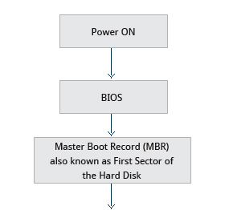
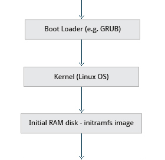
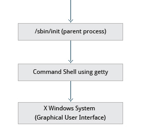

## La secuencia de arranque

La secuencia de arranque son todos los procesos necesarios antes de
tener un sistema funcional.

En esta sección del curso veremos como es esta secuencia de forma
general, sin entrar en los (bastante interesantes) detalles técnicos
de este proceso.

## Visión general

De forma resumida la secuencia en una PC es así:

::: {.columns}

:::: {.column width=20%}

{width=120%}

::::

:::: {.column width=20%}

{width=120%}

::::

:::: {.column width=20%}

{width=120%}

::::

:::

## BIOS: El primer paso

El BIOS es el primer programa que se ejecuta en una computadora, se
encarga de verificar el estado de hardware esencial para el arranque del
sistema y de preparar al procesador para comenzar la carga del sistema.

El BIOS busca al cargador del sistema en discos duros, unidades lectoras,
memorias USB, etc. Una vez localizado el cargador del sistema pasa el
control de la ejecución a este.

En sistemas antiguos el cargador de arranque debía estar en el MBR,
en sistemas modernos, se encuentra en la partición EFI.

## Gestor de arranque

El gestor de arranque (bootloader), se encarga de localizar el núcleo
del sistema operativo, cargarlo en la memoria RAM y darle toda la
información necesaria para que tome control de la máquina, esto suele
incluir pasarle parámetros al kernel e indicarle la ruta de la imagen
del sistema de ficheros inicial (initramfs).

En caso de encontrar más de un núcleo, se suele dar la opción al
usuario de elegir cual cargar a memoria.

En las distribuciones más comunes este gestor de arranque es GRUB2
(Grand Unified Bootloader), desarrollado por el proyecto GNU.

## Kernel Linux

Una vez en memoria, el kernel se descomprimirá a sí mismo en caso de
estar comprimido y comenzará a configurar todos los dispositivos y las
regiones de memoria que les corresponden.

Además descomprimirá, en caso de estar comprimido y *montará* el
sistema de ficheros inicial.

## Initramfs

El sistema de ficheros inicial es el primer sistema de ficheros al que
tiene acceso el kernel, provee algunos módulos necesarios para leer
sistemas de ficheros, firmware para controlar dispositivos adicionales,
y binarios para realizar tareas adicionales, por ejemplo, solicitar la
contraseña de discos cifrados.

En caso de que este sistema de ficheros contenga el binario init el kernel lo ejecutará y éste se encargará de buscar la partición raíz.

A esta etapa se le suele llamar espacio de usuario temprano.

## Programa init

Si el kernel no encontró el binario init en el initramfs, buscará y
montará la partición raíz por si mismo.

En esta partición buscará de nuevo el archivo /sbin/init y lo ejecutará
con el PID 1.

Este binario es el encargado de ejecutar todos los demás programas
necesarios para tener un sistema funcional y es el ultimo proceso en
terminar al apagar la computadora.

## Espacio de usuario

A todos los programas que se ejecutan fuera del kernel, se dice que corren en
espacio de usuario.

Estos programas no tienen acceso directo al hardware y solo pueden usar la memoria que le fue asignada por el kernel.

El espacio de usuario comienza a existir con la ejecución del proceso *init*, que es el primer programa que ejecuta el kernel.

## Niveles de ejecución

El *init* se encarga de llevar al sistema a un estado funcional, pero,
¿a qué me refiero con "sistema funcional"? *depende*

Un sistema puede requerir únicamente lanzar un par de programas y jamás
requerir interacción del usuario; otro tal vez necesite una línea de
comandos para interactuar con el usuario; uno más debe iniciar el
entorno de escritorio y la conexión de red, etc.

Cada una de estas tareas necesitan lanzar diferentes programas, al
conjunto de tareas necesaria para alcanzar cierto modo de operación se
les agrupa con el nombre de runlevel (SysV) o targets (systemd).

---
title: 'Arranque del sistema'
author: Emilio Cabrera
institute: Laboratorio de Investigación y Desarrollo de Software Libre
logo: '../res/img/lidsol.png'
theme: PaloAlto
colortheme: spruce
navigation: horizontal
output:
  beamer_presentation:
    slide_level: 2
---

